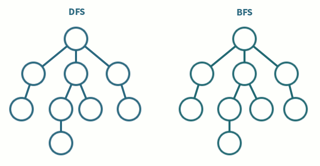

# BFS , DFS , Backtracking

## BFS.
> Breadth-First-Search, 너비 우선 탐색.  
> 주로 `queue` 를 사용해서 구현한다.  
### 특징. 
**1.** 노드 수가 적고 깊이가 얕은 경우 빠르게 동작한다.  
**2.** 단순 검색 속도가 DFS 보다 빠르다.  
**3.** 너비를 우선 탐색하기 때문에 답이 되는 경로가 여러 개인 경우에도 `최단경로` 임을 보장한다. -> 가중치가 있는 경우 `priority_queue` 를 이용해 최단경로를 구해준다.  
**4.** DFS 와 달리 `queue` 에 노드를 저장해야 하기 때문에 메모리가 많이 필요하다. -> 알고리즘 문제 풀 시 메모리 초과 주의.(`visit` 체크를 잘해주어야 한다.)   

**시간복잡도  : 인접리스트 :O(N+E) / 인접 행렬 : O(N^2)**
## DFS 
> Depth-First-Search, 깊이 우선 탐색  
> 주로 재귀 함수를 사용해 구현한다.  

### 특징
**1.** 저장 공간의 수요가 비교적 적다(현재 경로상 노드만 기억하면된다.  
**2.** BFS 보다 구현이 간단하다.  
**2.** 단순 검색 속도가 BFS 보다 느리다.  
**3.** 구한 경로가 최단 경로가 된다는 보장이 없다.  

**시간복잡도  : 인접리스트 :O(N+E) / 인접 행렬 : O(N^2)**  

## Backtracking
> 완전 탐색 도중 해당 위치에서 정답이 아닌 경우 더 이상 진행하지 않고 이전 경우로 돌아가는 방법.  
> 주로 재귀 함수를 사용해 구현한다.  

### 특징
**1.** 정답이 아닌 경우 더 이상 진행하지 않는 경우를 `가지치기(pruning)` 이라 표현한다.  
**2.** *가지치기를 얼마나 잘 해주느냐* 에 따라서 해당 알고리즘의 효율이 결정될 정도로 중요하다.  

[잘 정리되어 있는 블로그 참고](https://gmlwjd9405.github.io/2018/08/15/algorithm-bfs.html)

## 예제 문제.

### [1260 DFS와 BFS](./1260_DFS와BFS.py)
DFS , BFS 의 가장 기본적인 형태.  
재귀와 큐를 이용해서 탐색을 구현.  

### [2206 벽 부수고 이동하기](./2206_벽부수고이동하기.py)
`visited` 배열을 2중배열로만 해보려고 했는데 메모리 초과뜸..  
부수고 가는 경우와 아닌 경우를 구분하지 않아서 생긴 오류라고 생각함. 
그래서 경우를 나눠서 풀어줌.   
-> visited 배열의 체크가 들린지 아닌지가 아닌 크기의 따르기 때문에 q 의 크기가 계속 커짐.
-> 예제 1번에 경우 경우를 나누면 q의 크기는 19 아닌경우 33 => 거의 2배 가까운 메모리 낭비 발생.  

### [14442 벽 부수고 이동하기2](./14442_벽부수고이동하기2.py)
`2206 벽부수고 이동하기` 와 같은 로직에 부수는 경우의 수를 추가해줌.  
시간초과 잡느라 고생함 -> 부수고 가는 경우의 `visited` 배열도 확인해줘야한다!!!  

### [1600 말이 되고픈 원숭이](./1600_말이되고픈원숭이.py)
`14442 벽 부수고 이동하기2` 를 풀고나면 쉽게 풀 수 있다.  
말처럼 움직이는 경우를 나눠서 생각하면 된다.  

### [1707 이분그래프](./1707_이분그래프.py)
그래프 이론에서, `이분 그래프란 모든 꼭짓점을 빨강과 파랑으로 색칠하되, 모든 변이 빨강과 파랑 꼭짓점을 포함하도록 색칠할 수 있는 그래프`. [위키백과](https://ko.wikipedia.org/wiki/%EC%9D%B4%EB%B6%84_%EA%B7%B8%EB%9E%98%ED%94%84).  
변별 방법 : 각 정점에서 BFS 로 이웃한 곳에 다른 색 칠하기(-1) -> 만약 같은 색이다 그러면 이분 그래프 아님.  

### [9019 DSLR](./9019_DSLR.py)
python 시간초과로 pypy 제출.  
4가지 경우에 맞춰서 BFS 돌려주면 된다. 이 때 바뀐 순서(path) 를 가지고 다닌다.  
visited 의 값의 범위를 최대값인 10,000으로 해주어야 한다 -> 커졌다가 작아지는 경우의 수 존재.  

### [1987 알파벳](./1987_알파벳.py)
dfs,bfs 전부다 메모리 초과에 시간초과에 화나서 c++ 로 품.  
`queue` 에 중복으로 들어가는 부분 때문에 메모리 터지는 거라 `set` 으로 바꾸면 된다.(검색해서 깨달음 근데 이게 맞나...) 

### [1937 욕심쟁이판다](./1937_욕심쟁이판다.py)
bfs 로 모든 위치에서 다 돌려버리니까 시간초과.  
그래서 각 위치에서의 최대값을 저장해서 이미 들린곳이면 그 값 출력해줌.  

### [10026 적록색약](./10026_적록색약.py)
적록색약인 경우와 아닌경우 따로 bfs 돌려주면 된다.  
bfs 하나에서 경우를 나눠서 해줘도 되지만 따로해주는 걸 선호.  

### [16946 벽부수고이동하기4](./16946_벽부수고이동하기4.py) 
단순히 1 위치에서 BFS 돌면 시간초과가 난다.  
0 개수를 세주고 상하좌우에 0 개수가 몇개인지 더해주는 방식으로 진행. -> 중복 발생.  
zero 그룹 만들어서 중복 제거 해주었다.  

### [2233 사과나무](./2233_사과나무.py)
par,child 배열 만들어서 1,0 개수 세서 풀어줬는데 틀렸다. -> 부모노드 찾을 때 노드 깊이를 맞춰주지 않아서 생긴 문제.(검색해봄)  
노드 깊이를 맞추지 않게 되는 경우 각 노드를 동시에 부모로 올리기 때문에 루트 노드에서만 만나게 된다.  
one,zero 배열을 따로 만들면 x,y 위치에 노드와 i,j 를 구할 때 편리하다.  

### [9205 맥주마시면서걸어가기](./9205_맥주마시면서걸어가기_bfs.py)
bfs 와 플로이드-와샬로 풀 수 있는 문제.  
모두 해당 지점에서 다음 지점으로 갈 수 있는 지(거리가 <= 1000) 체크 해서 배열만들어주면 된다.  

### [9663 N_Queen](./9663_N_Queen.py)
`sys.setrecursionlimit` 은 `pypy` 에서 사용못한다.  
그리고 저거 때문에 메모리 초과가 나는 걸로 봐서 재귀 풀때 무조건 써준다고 생각하면 안될듯.  

### [2580 스도쿠](./2580_스도쿠.py)
0 인 칸들의 위치를 저장 후 dfs 돌면서 하나씩 채워나가는 방법.  
해당 위치에 넣을 수 있는 숫자 후보를 만들어 백트래킹해주는 것이 핵심. 

### [1488 스타트와링크](./1488_스타트와링크.py)
`itertools.combination` 을 사용하면 쉽게 구현 할 수 있다.  
취지에 맞게 백트레킹으로도 구현해줌. 팀 구분을 0,1 을 통해서 dfs 돌려주면 된다.  

### [20927 DegreeBoundedMinimumSpanningTree](20927_DegreeBoundedMinimumSpanningTree.py)
크루스칼 알고리즘을 이용해서 MST 구해줄 때 간선 개수만 체크해주면 42%에서 틀림.  
-> 최소비용으로만 돌아서 완전 탐색이 되지않는다.  
완전 탐색하면서 `backtracking` 으로 풀어주면 된다.  
`global` 변수 처리를 잘해주어야 한다. find-merge 함수에서 `global` 처리를 잘 안해주어서 계속 틀림.  
 

 

